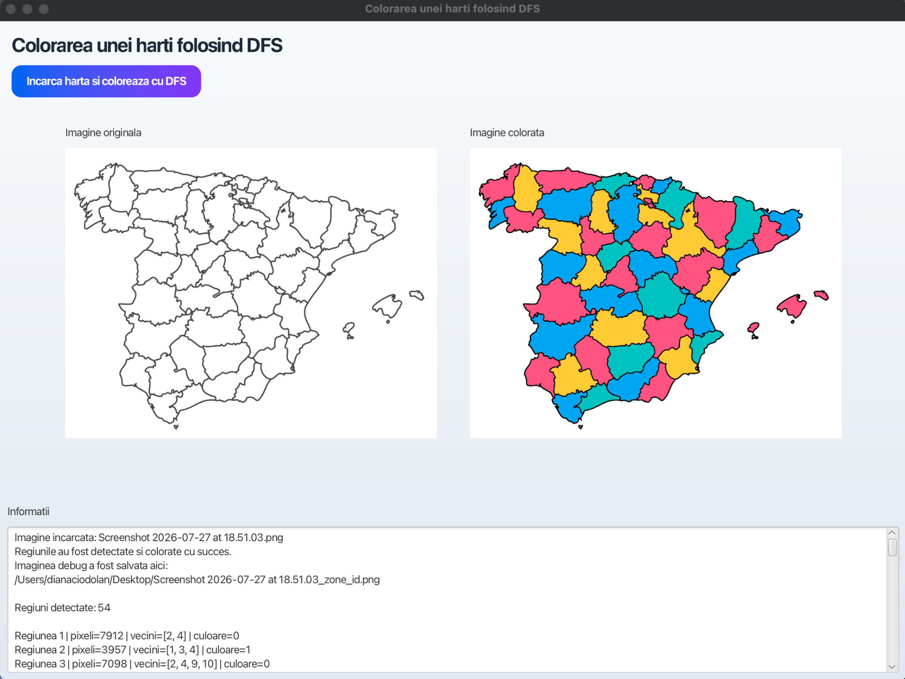
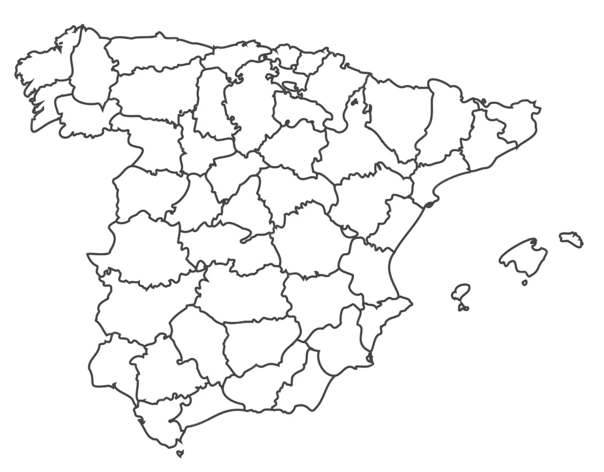
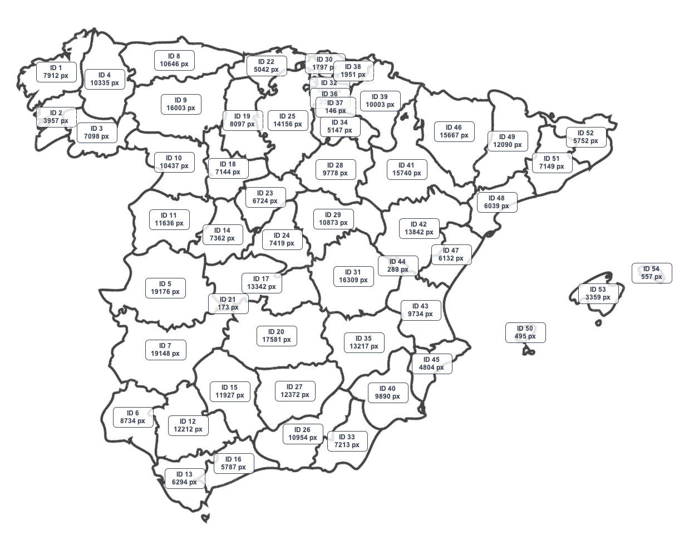

# Map Colouring with DFS

Map Colouring with DFS is a JavaFX desktop application that detects enclosed regions in a map image, builds a region-adjacency graph and assigns colours so that neighbouring regions receive different colours.

The project combines image processing, graph modelling, depth-first search and recursive backtracking in an interactive graphical interface.

## Screenshots

### Application Interface

The application displays the original map and the final coloured result side by side. It also provides diagnostic information about the detected regions, assigned colours and neighbouring regions.



### Original Map

The input is a black-and-white map in which dark lines represent the boundaries between regions.



### Region Detection

Each enclosed area is detected as an individual connected region and receives a unique identifier. The diagnostic image also displays the number of pixels contained in each region.



## Features

- Load map images using a JavaFX file chooser
- Detect enclosed regions through connected-component analysis
- Classify pixels as boundaries or free space
- Ignore the exterior background
- Remove very small regions considered image noise
- Build an adjacency graph from neighbouring regions
- Colour the graph using DFS and recursive backtracking
- Ensure adjacent regions receive different colours
- Display the original and processed images side by side
- Generate a diagnostic image with region IDs
- Display the pixel count for each detected region
- Show detailed information about neighbouring regions
- Process images locally without an external API

## How It Works

1. The user selects a map image containing dark, fully closed boundaries.
2. The application reads the image at pixel level.
3. Pixels are classified as either boundaries or free space using a configurable threshold.
4. An iterative DFS flood-fill algorithm identifies connected areas.
5. The exterior background and very small regions are excluded.
6. Each remaining enclosed area becomes a graph node.
7. The application examines nearby pixels to determine which regions are adjacent.
8. An adjacency graph is created.
9. A recursive backtracking algorithm assigns colours to the regions.
10. The final coloured map and diagnostic information are displayed.

## Processing Workflow

```text
Map Image Selection
        │
        ▼
Pixel Classification
        │
        ├── Boundary pixels
        └── Free-space pixels
        │
        ▼
Connected Region Detection
        │
        ├── Iterative DFS flood fill
        ├── Exterior removal
        └── Noise-region filtering
        │
        ▼
Adjacency Graph Construction
        │
        ├── Region nodes
        └── Neighbour relationships
        │
        ▼
Graph Colouring
        │
        ├── DFS traversal
        └── Recursive backtracking
        │
        ▼
Coloured Map and Diagnostic Output
```

## Technology Stack

- Java 21
- JavaFX 21
- Maven
- Java AWT image processing
- `BufferedImage`
- Pixel-level image manipulation
- Depth-first search
- Flood-fill algorithms
- Graph modelling
- Recursive backtracking
- Hash maps
- Hash sets
- Stacks
- ImageIO

## Project Structure

```text
src/main/java/
├── MainApp.java
├── MapImageProcessor.java
├── Region.java
└── FxImageUtils.java
```

| Class | Responsibility |
|---|---|
| `MainApp.java` | Manages the JavaFX interface, file selection and application workflow |
| `MapImageProcessor.java` | Performs boundary detection, region detection, graph construction and colouring |
| `Region.java` | Stores region pixels, neighbouring regions and the assigned colour |
| `FxImageUtils.java` | Converts `BufferedImage` objects for display in JavaFX |

## Main Components

### JavaFX Interface

The graphical interface allows users to:

- choose a map image;
- start the processing workflow;
- compare the original and coloured images;
- inspect information about detected regions;
- view neighbouring-region relationships;
- analyse the diagnostic output.

### Image Processor

The image-processing component is responsible for:

- reading pixels from the selected image;
- identifying dark boundary pixels;
- detecting connected free-space regions;
- filtering the exterior background;
- ignoring very small regions;
- building adjacency relationships;
- rendering the final result.

### Region Model

Each detected region stores:

- a unique identifier;
- its collection of pixels;
- the number of pixels it contains;
- its neighbouring regions;
- its assigned colour.

## Region Detection

The application uses connected-component detection to find enclosed areas.

Each unvisited free-space pixel can start a new region. An iterative depth-first search explores all pixels connected to that starting point.

The DFS uses a stack instead of recursive flood fill, helping avoid excessive recursion depth when processing large regions.

A detected area is considered a valid region only when it:

- is enclosed by boundaries;
- is not part of the exterior background;
- contains more pixels than the configured minimum size.

## Boundary Detection

Each image pixel is analysed to determine whether it represents a map boundary.

A configurable brightness threshold separates:

- dark boundary pixels;
- light free-space pixels.

For best results, the input image should contain:

- dark and clearly visible boundaries;
- fully closed shapes;
- a light background;
- limited image noise;
- minimal anti-aliasing around region borders.

## Adjacency Graph

After the regions are detected, the application creates a graph.

In this graph:

- every region is represented by a node;
- an edge connects two nodes when their regions are neighbours;
- neighbouring regions must receive different colours.

Conceptually, the graph can be represented as:

```text
Region 1 → Region 2, Region 4
Region 2 → Region 1, Region 3
Region 3 → Region 2, Region 4
Region 4 → Region 1, Region 3
```

The neighbour relationships are stored using adjacency sets to prevent duplicate edges.

## Graph Colouring

The colouring process assigns a colour to every graph node.

For each region, the algorithm:

1. checks the colours already assigned to neighbouring regions;
2. tries the available colours one by one;
3. assigns the first valid colour;
4. continues with the next region;
5. backtracks when no valid colour is available;
6. tries another colour combination.

The solution is valid when every detected region has a colour and no two adjacent regions share the same colour.

## Algorithms Used

### Iterative Depth-First Search

Iterative DFS is used to detect connected areas of free pixels.

The algorithm uses a stack to:

- visit neighbouring pixels;
- mark pixels as processed;
- collect all pixels belonging to the same region;
- avoid repeated visits.

### Flood Fill

Flood fill groups connected pixels into individual map regions.

The application checks neighbouring pixel positions until the complete connected component has been explored.

### Graph Construction

The detected regions are transformed into graph nodes.

Neighbour checks identify the graph edges required for the colouring process.

### Recursive Backtracking

Backtracking is used when assigning region colours.

When the current colour choice prevents a later region from receiving a valid colour, the algorithm returns to a previous region and tries another option.

## Running the Application

### Requirements

- JDK 21
- Maven 3.9 or newer

### Clone the Repository

```bash
git clone https://github.com/dianuca/map-colouring-dfs.git
cd map-colouring-dfs
```

### Run with Maven

```bash
mvn clean javafx:run
```

The JavaFX application window should open automatically.

## Using the Application

1. Start the application.
2. Select the option for loading a map.
3. Choose a supported image file.
4. Wait for the region-detection process to finish.
5. Examine the original image.
6. Examine the generated coloured map.
7. Review the region and neighbour information.
8. Open the diagnostic image to inspect region identifiers and pixel counts.

## Recommended Input Images

For the best results, use maps with:

- a light or white background;
- dark region boundaries;
- fully enclosed regions;
- sufficiently thick border lines;
- clear separation between areas;
- limited compression artefacts;
- no large gaps in the boundaries.

Supported image formats depend on Java ImageIO and typically include:

```text
PNG
JPG
JPEG
BMP
```

PNG is recommended because it preserves clear edges without lossy compression.

## Diagnostic Output

The application can generate a diagnostic image containing:

- the identifier assigned to each region;
- the approximate centre of the region;
- the number of pixels contained in the region;
- visual information useful for verifying detection accuracy.

This output helps identify:

- regions that were not detected;
- regions that were incorrectly merged;
- very small noise regions;
- problems caused by broken boundaries.

## Performance Considerations

Processing time depends on:

- image width and height;
- total number of pixels;
- number of detected regions;
- number of adjacency relationships;
- complexity of the graph-colouring search.

Large images require more memory because the application analyses pixels and stores information about detected regions.

Images can be resized before processing when extremely high resolution is unnecessary.

## Current Limitations

- Broken boundaries can cause multiple regions to be merged
- Very light borders may not be classified as boundaries
- Anti-aliased edges can affect region detection
- Very small valid regions may be treated as noise
- Processing thresholds are predefined
- Large images may require additional memory
- Complex graphs may require more backtracking
- The interface and some source-code identifiers may still be written in Romanian
- Manual correction of incorrectly detected regions is not currently supported
- The adjacency graph is not exported as a separate file

## Future Improvements

- Add automatic boundary-threshold detection
- Allow users to configure the boundary threshold
- Allow users to configure the minimum region size
- Add manual colour-palette selection
- Support custom numbers of colours
- Improve detection of anti-aliased boundaries
- Repair small gaps in broken boundaries
- Add image preprocessing before region detection
- Display the adjacency graph visually
- Export the graph as JSON or another format
- Add automated tests using generated maps
- Add performance tests for large images
- Add drag-and-drop image loading
- Add zoom and pan controls
- Add result export directly from the interface
- Add progress indicators for large images
- Rename the remaining Romanian identifiers into English
- Translate the complete interface into English
- Package the application for macOS and Windows

## Concepts Demonstrated

This project demonstrates:

- Java desktop application development;
- JavaFX interface design;
- image loading and processing;
- pixel-level image analysis;
- connected-component labelling;
- iterative depth-first search;
- flood-fill algorithms;
- graph construction from image data;
- adjacency-list representation;
- graph colouring;
- recursive backtracking;
- constraint satisfaction;
- hash-based collections;
- separation between interface, processing and data models.

## Author

**Diana Ciodolan**

Computer Science graduate and master's student in Advanced Information Systems and Technologies.
